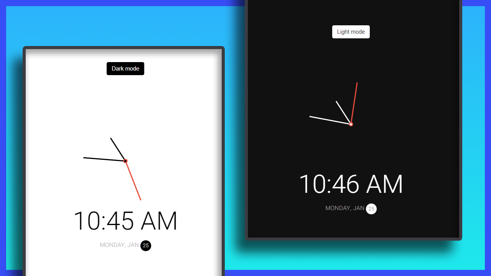

# Mini Project: Theme Clock

## Date: 25 - Jan - 2021

### Functions:

- Display Clock Needle (hh/mm/ss)
- Display Time (HH/MM/(AM-PM))
- Display Date (yy,mm,dd)

### Template

https://dribbble.com/shots/5958443-Alarm-clock

### Screenshot

### Tech-Stack

- HTML/CSS
- JS

### After this project

I have improve my knowledge about:

- review my knowledge in html/css
- learn DOM Manipulation
