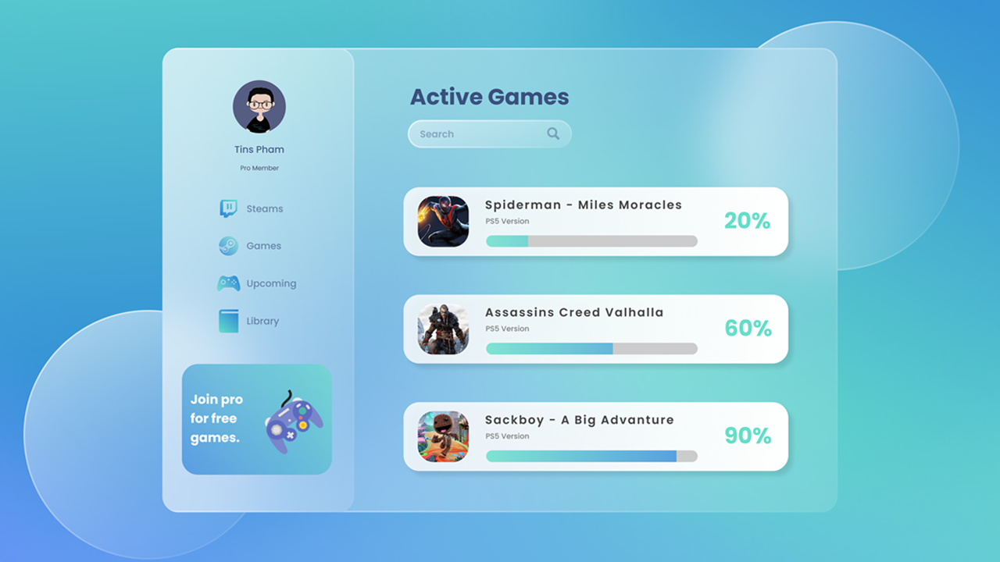

# Mini Project: Glass UI - Dashboard Game

### Date: 27 - Jan - 2021

### Screenshot

### Tech-Stack

- Figma
- Icons
  - [iconmonstr.com](https://iconmonstr.com/)
  - [icons8.com](https://icons8.com/)

### Figma Link:

- [Link](https://www.figma.com/file/LVQjL15BxwzrdrDz9d71GL/Daily-UI-5-Glass-UI?node-id=1%3A2)
- Open issues or <a href="mailto:tinphamvan123@gmail.com"> Email</a> for get full access to figma file

### After This Project

- i have learn
  - use [Color Adobe](https://color.adobe.com/create/color-wheel) for get linear color
  - what is Glass UI
  - How to make Glass UI
  - how to make a progress bar UI
  - basic knowledge in Figma
