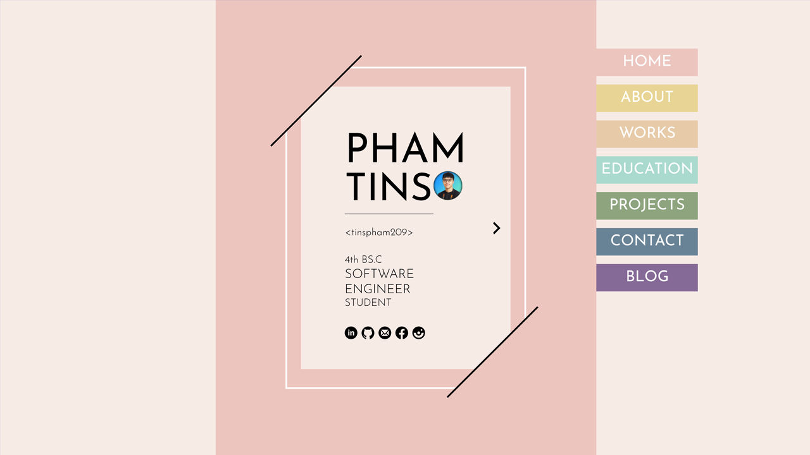
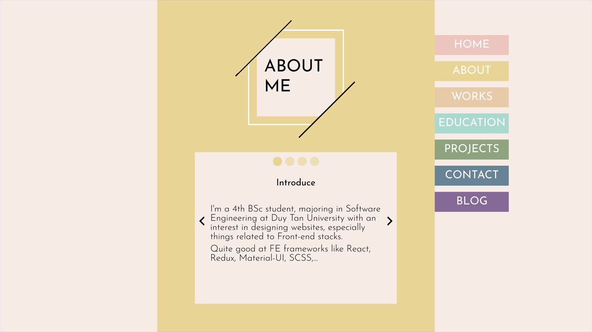
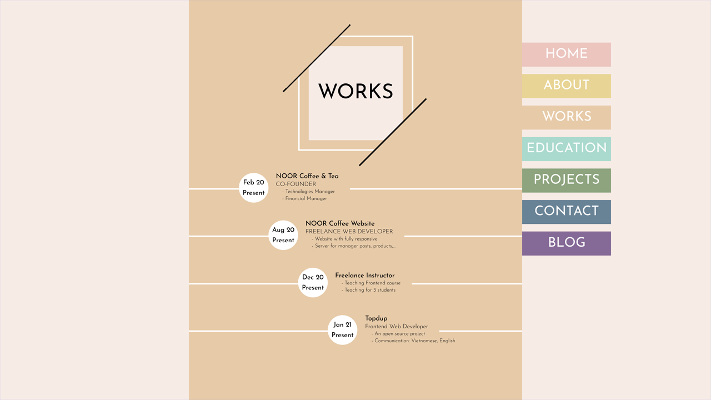
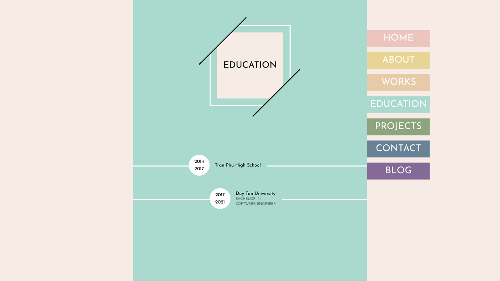

# Mini Project: My Portfolio

### Date: 29 - Jan - 2021

### Screenshot

### Tech-Stack

- Figma
- Iconify plugin
- Prototype

### Figma Link:

- [Link](https://www.figma.com/file/cg50DRHqMCxqsO659FSXYx/My-Portfolio?node-id=0%3A1)
- Open issues or <a href="mailto:tinphamvan123@gmail.com"> Email</a> for get full access to figma file

### After This Project

- i have learn
  - use [Color Adobe](https://color.adobe.com/create/color-wheel) for get linear color
  - prototype with Figma
  - Grid Layout
